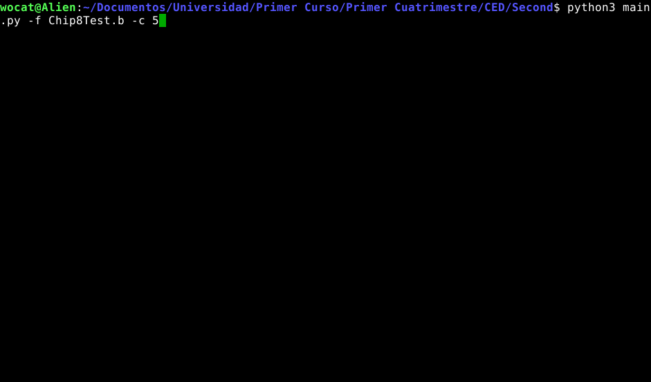

#  Second

Second is an Hertz CPU interpreter. It lets you debug programs without reflashing the FPGA every time you want to try something. As Hertz is based on the CHIP8 it also lets you debug non-graphical programs made for it.

## Requirements

 - Python3
 - Pygame
 - Npyscreen

## Usage
    usage: main.py [-h] [-f FILE] [-c CLOCK_SPEED] [-d]
    
    optional arguments:
      -h, --help            show this help message and exit
      -f FILE, --file FILE
      -c CLOCK_SPEED, --clockspeed CLOCK_SPEED
      -d, --dump

Dump makes the interpreter dump the contents of registers on screen when the program ends.